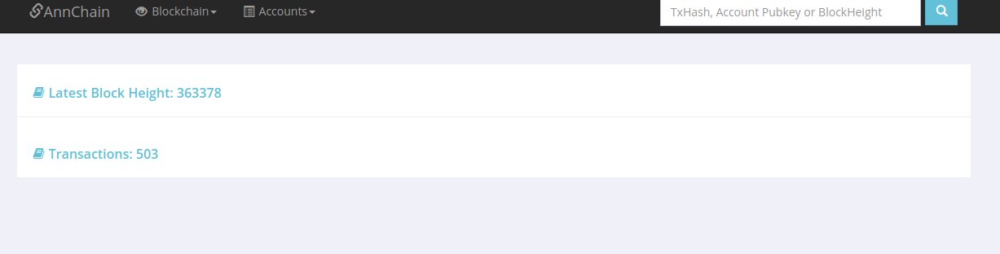
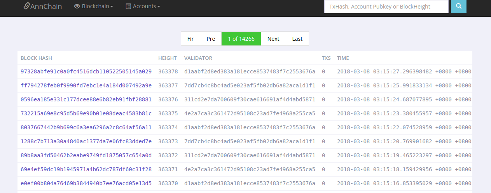
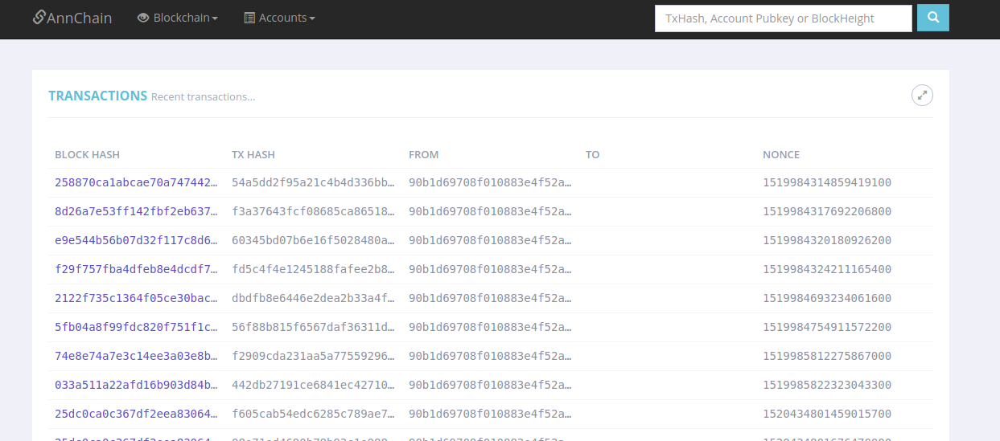
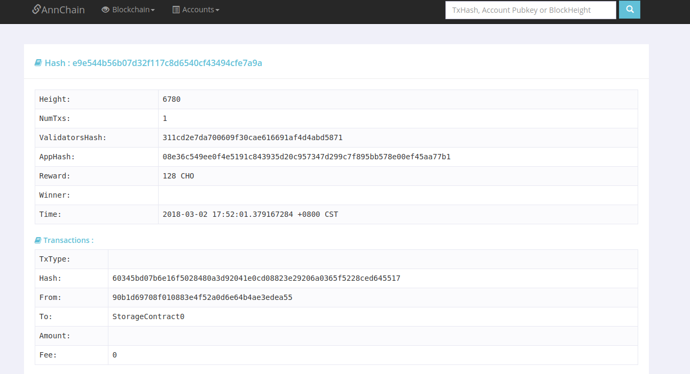

## 编译

```shell
make
```
或者
```shell
go build
```


1. 配置 conf文件

- 修改配置文件`conf/app.conf`：
`appname`是服务名称。`httpport`是服务端口。`runmode`是程序运行模式(`dev`/`prod`)。`mogo_addr`是mongo服务的地址，如果不填，则默认使用sqlite3。`api_addr`是区块链节点对外的api服务地址。`chain_id`是浏览器展示的区块链链名称。
- 存储方式可选用mongo or sqlite。 mongo 为生产使用。如果不填 默认生成sqlite 本地测试数据库。
```toml
appname = hubble
httpport = 9090
runmode ="dev"

api_addr = "127.0.0.1:46657" 
chain_id = "chorus"
                                   
mogo_db = "hubble"
sync_job = 1

mogo_addr = "127.0.0.1:27017"
mogo_user = hzc
mogo_pwd = 123456

```


## 运行

```shell
./block-browser
```

## 使用

```
  http://localhost:9090
```
- 当前链的高度和交易数量
右上方输入框可以根据交易hash，账户公钥，和块高度查看相关详细数据：



- 块数据


- 交易数据



点开交易哈希的连接，可以看到交易在该块的详细数据：
